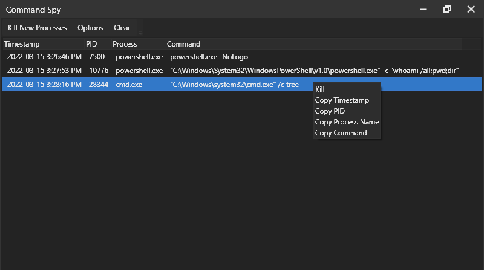
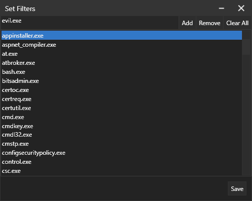

# Command Spy

Command Spy is a utility for monitoring new processes on a Windows machine. It allows you to see the command line options that are run with each new process. You can filter for specific executables (uses LOLBAS by default) and automatically kill new processes. This was made as an experiment for CCDC.

This uses WMI to get new processes. A caveat to this is WMI is somewhat slow, meaning if a process starts and finishes within a very short time (sub-second), an event may not be triggered.

Requires .NET 4.6.2+

## Screenshots

# Credits

Theme: [https://github.com/AngryCarrot789/WPFDarkTheme](https://github.com/AngryCarrot789/WPFDarkTheme)
